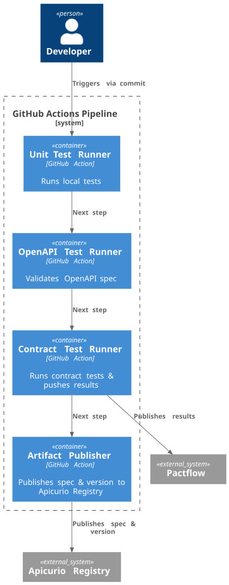

# API-CICD-Pipeline
POC for API pipeline

This is a POC project to run Github actions as pipeline for a project with Openapi spec. 

The pipeline should:
* run local unit tests
* run Openapi tests
* run contract tests and publish the artifact to Pactflow
* publish artifact to Apicurio registry including app version

